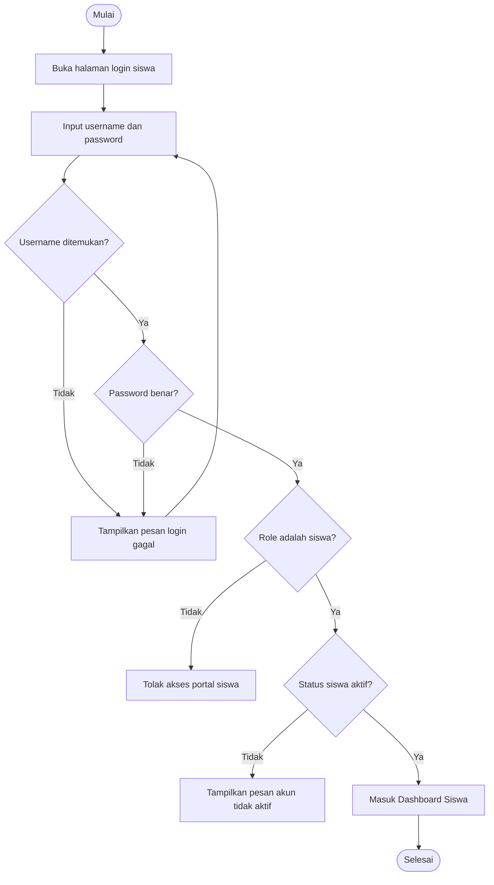
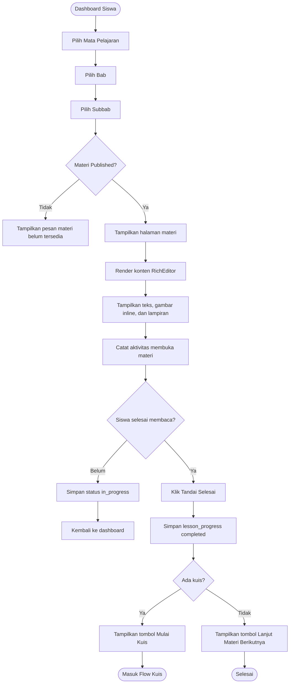
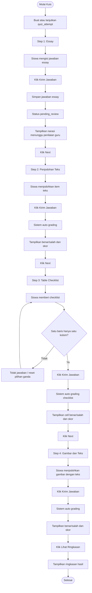
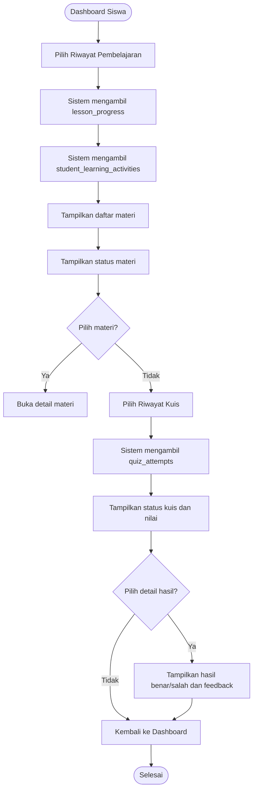
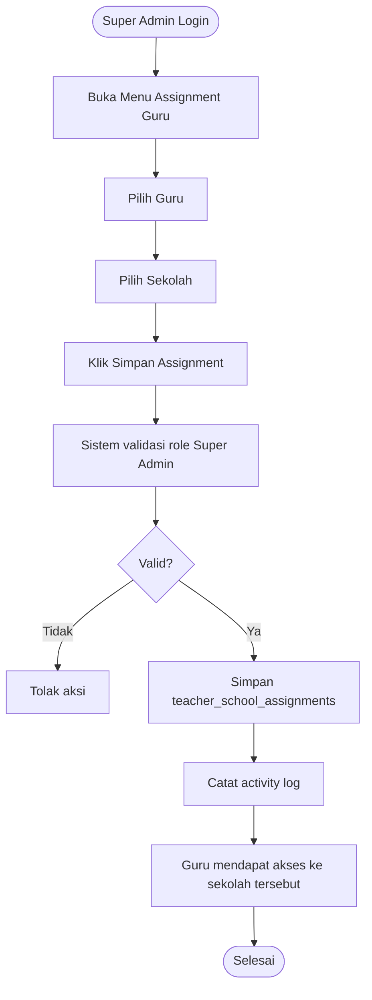
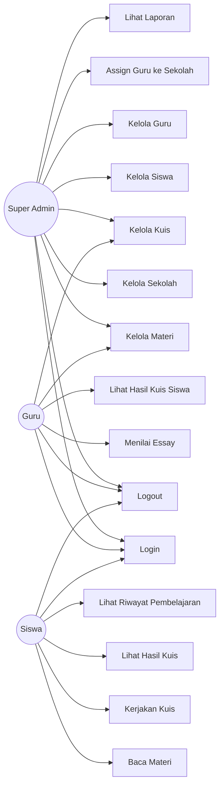

# PROJECT REQUIREMENT DOCUMENT

## Web LMS Pembelajaran SIG dengan Data Siswa dari Berbagai Sekolah dan Assignment Guru Berbasis Sekolah

**Versi:** 2.0
**Status:** Draft Final untuk Kebutuhan Sidang Skripsi
**Format:** Markdown
**Framework Backend:** Laravel 12
**Admin Panel:** Filament 4
**Frontend Build Tool:** Vite
**Database:** MySQL
**Media Management:** Spatie Laravel Media Library
**Role & Permission:** Filament Shield
**UI Admin/Guru:** Filament Panel
**UI Siswa:** Laravel Blade/Livewire/Tailwind Custom

---

# 1. Catatan Perubahan Versi 2.0

PRD ini merupakan hasil penyederhanaan dari rancangan LMS multi-sekolah sebelumnya. Karena proyek ini digunakan untuk kebutuhan sidang skripsi, sistem tidak dibuat sebagai multi-tenant sekolah penuh.

Perubahan utama:

1. Sistem dibuat sebagai LMS terpusat.
2. Sekolah tidak menjadi tenant terpisah.
3. Sekolah digunakan sebagai data asal siswa.
4. Sekolah juga digunakan sebagai dasar pembatasan akses guru.
5. Role Admin Sekolah dihapus dari MVP.
6. Role utama hanya Super Admin, Guru, dan Siswa.
7. Guru tetap dapat di-assign ke satu atau beberapa sekolah oleh Super Admin.
8. Guru hanya dapat melihat siswa, hasil kuis, essay, dan riwayat pembelajaran dari sekolah yang di-assign.
9. Siswa login menggunakan username dan password.
10. Email siswa hanya menjadi data tambahan.
11. Username siswa wajib unik.
12. Pendaftaran siswa dilakukan manual melalui form admin.
13. Fitur import siswa Excel/CSV tidak digunakan.
14. Materi tetap menggunakan RichEditor bawaan Filament 4.
15. Gambar dapat diupload di tengah materi.
16. Kuis tetap menggunakan 4 jenis: essay, penjodohan teks, table checklist, dan penjodohan gambar-teks.
17. Kuis dikerjakan secara berurutan menggunakan sequential quiz flow.
18. Dashboard siswa tetap menampilkan progres belajar, riwayat materi, dan riwayat kuis.

---

# 2. Ringkasan Produk

Web LMS Pembelajaran SIG adalah aplikasi pembelajaran daring berbasis web yang digunakan untuk menyajikan materi Sistem Informasi Geografis, mengelola data siswa dari berbagai sekolah, mengelola guru, menyusun materi pembelajaran berbasis bab dan subbab, menyediakan kuis interaktif, melakukan penilaian otomatis, menyediakan penilaian manual oleh guru, serta menampilkan riwayat pembelajaran siswa.

Sistem ini tidak menggunakan konsep multi-tenant sekolah penuh. Artinya, setiap sekolah tidak memiliki dashboard dan admin sekolah masing-masing. Sekolah hanya digunakan sebagai identitas asal siswa dan dasar pembatasan akses guru.

Super Admin bertugas mengelola seluruh sistem, termasuk sekolah, siswa, guru, materi, kuis, assignment guru, dan laporan. Guru dapat melihat serta menilai data siswa hanya dari sekolah yang telah di-assign oleh Super Admin. Siswa dapat login menggunakan username dan password, membaca materi, mengerjakan kuis, melihat hasil kuis, dan memantau riwayat pembelajaran.

---

# 3. Tujuan Pengembangan

Tujuan pengembangan sistem adalah:

1. Menyediakan LMS sederhana dan terarah untuk kebutuhan sidang skripsi.
2. Menyediakan sistem pembelajaran SIG berbasis web.
3. Mengelola data siswa dari berbagai sekolah.
4. Menjadikan sekolah sebagai data asal siswa dan filter laporan.
5. Memungkinkan Super Admin mengatur guru yang bertanggung jawab pada sekolah tertentu.
6. Memudahkan guru melihat siswa dari sekolah yang di-assign.
7. Memudahkan guru menilai jawaban essay siswa.
8. Menyediakan login siswa menggunakan username dan password.
9. Menjamin username siswa unik saat pendaftaran.
10. Menyediakan CMS materi berbasis RichEditor.
11. Memungkinkan upload gambar di tengah pembahasan materi.
12. Menyediakan kuis interaktif dengan 4 jenis kuis.
13. Menyediakan penilaian otomatis untuk kuis non-essay.
14. Menyediakan penilaian manual untuk kuis essay.
15. Menyediakan dashboard siswa.
16. Menyediakan riwayat pembelajaran dan riwayat kuis siswa.
17. Menyediakan laporan hasil belajar berdasarkan sekolah, siswa, materi, dan kuis.
18. Menyediakan sistem role dan permission yang cukup aman tetapi tetap sederhana.

---

# 4. Konsep Sistem

## 4.1 Konsep Utama

Sistem menggunakan konsep:

```text
Single LMS Terpusat
+
Data Siswa dari Berbagai Sekolah
+
Assignment Guru Berbasis Sekolah
+
Bukan Multi-Tenant Sekolah Penuh
```

Artinya, sekolah tidak diperlakukan sebagai tenant yang berdiri sendiri. Sekolah hanya menjadi data referensi untuk siswa dan filter akses guru.

---

## 4.2 Ilustrasi Konsep

```text
Super Admin
    ↓
Mengelola Sekolah
    ↓
Mengelola Siswa dari Berbagai Sekolah
    ↓
Mengelola Guru
    ↓
Assign Guru ke Sekolah Tertentu
    ↓
Guru melihat siswa dan hasil kuis dari sekolah yang di-assign
    ↓
Siswa login, membaca materi, mengerjakan kuis, melihat riwayat
```

---

## 4.3 Perbedaan dengan Multi-Tenant Sekolah

| Aspek                             | Sistem Ini                     | Multi-Tenant Sekolah Penuh |
| --------------------------------- | ------------------------------ | -------------------------- |
| Admin sekolah                     | Tidak ada                      | Ada                        |
| Dashboard sekolah terpisah        | Tidak ada                      | Ada                        |
| Database per sekolah              | Tidak ada                      | Bisa ada                   |
| Materi per sekolah                | Tidak wajib                    | Biasanya ada               |
| Sekolah sebagai tenant            | Tidak                          | Ya                         |
| Sekolah sebagai data asal siswa   | Ya                             | Ya                         |
| Guru dibatasi berdasarkan sekolah | Ya                             | Ya                         |
| Kompleksitas                      | Sedang dan cocok untuk skripsi | Tinggi                     |
| Cocok untuk sidang skripsi        | Ya                             | Terlalu kompleks           |

---

# 5. Ruang Lingkup Sistem

## 5.1 Ruang Lingkup MVP

Fitur yang masuk dalam MVP:

1. Login dan logout.
2. Manajemen user.
3. Manajemen role dan permission.
4. Manajemen sekolah sebagai data asal siswa.
5. Manajemen siswa melalui form manual.
6. Manajemen guru.
7. Assignment guru ke sekolah tertentu oleh Super Admin.
8. Manajemen mata pelajaran/kursus.
9. Manajemen bab.
10. Manajemen subbab.
11. CMS materi dengan RichEditor.
12. Upload gambar di tengah materi.
13. Upload cover materi.
14. Upload lampiran materi.
15. Portal siswa.
16. Dashboard siswa.
17. Riwayat pembelajaran siswa.
18. Riwayat kuis siswa.
19. Kuis essay.
20. Kuis penjodohan teks.
21. Kuis table checklist.
22. Kuis penjodohan gambar dan teks.
23. Sequential quiz flow.
24. Auto grading kuis non-essay.
25. Manual grading essay oleh guru.
26. Tampilan hasil benar dan salah.
27. Ringkasan hasil kuis.
28. Dashboard guru.
29. Dashboard super admin.
30. Laporan nilai.
31. Laporan progres belajar.
32. Activity log untuk aktivitas penting.

---

## 5.2 Di Luar Ruang Lingkup MVP

Fitur berikut tidak masuk MVP:

1. Multi-tenant sekolah penuh.
2. Admin Sekolah.
3. Dashboard khusus sekolah.
4. Import siswa menggunakan Excel/CSV.
5. Video conference live.
6. Chat guru dan siswa.
7. Forum diskusi.
8. Sertifikat otomatis.
9. Gamifikasi lengkap.
10. Payment gateway.
11. Mobile app native Android/iOS.
12. AI grading untuk essay.
13. Proctoring ujian.
14. Integrasi Dapodik.
15. Integrasi SSO eksternal.
16. Recommendation engine berbasis AI.
17. Workflow approval assignment guru.
18. Materi berbeda per sekolah.
19. Database terpisah per sekolah.

---

# 6. Target Pengguna

## 6.1 Super Admin

Super Admin adalah pengelola utama sistem. Super Admin dapat mengelola seluruh data, termasuk sekolah, siswa, guru, materi, kuis, assignment guru, hasil kuis, dan laporan.

## 6.2 Guru

Guru adalah pengguna yang bertugas mengelola materi, membuat kuis, melihat hasil belajar siswa, dan menilai jawaban essay. Guru hanya dapat melihat data siswa dari sekolah yang di-assign oleh Super Admin.

## 6.3 Siswa

Siswa adalah pengguna yang mengakses portal pembelajaran. Siswa dapat membaca materi, mengerjakan kuis, melihat hasil kuis, melihat status essay, dan melihat riwayat pembelajaran.

---

# 7. Role dan Hak Akses

| Role        | Hak Akses Utama                                                                                                  |
| ----------- | ---------------------------------------------------------------------------------------------------------------- |
| Super Admin | Mengelola seluruh data sistem, sekolah, siswa, guru, materi, kuis, assignment guru, laporan, dan role permission |
| Guru        | Mengelola materi dan kuis, menilai essay, melihat hasil siswa dari sekolah yang di-assign                        |
| Siswa       | Mengakses materi, mengerjakan kuis, melihat hasil, dan melihat riwayat pembelajaran                              |

---

# 8. Prinsip Role Permission dan Data Scope

Sistem membedakan dua konsep:

| Konsep          | Fungsi                                               |
| --------------- | ---------------------------------------------------- |
| Role Permission | Menentukan fitur apa yang boleh diakses user         |
| Data Scope      | Menentukan data sekolah mana yang boleh dilihat user |

Contoh:

```text
Guru A memiliki role Guru.
Guru A di-assign ke SMP 1 dan SMP 2.
Maka Guru A hanya dapat melihat siswa, hasil kuis, dan essay dari SMP 1 dan SMP 2.
Guru A tidak dapat melihat data SMP 3.
```

Role Guru memberi hak untuk mengakses fitur guru. Assignment sekolah membatasi data yang bisa dilihat guru.

---

# 9. Modul Autentikasi

## 9.1 Fitur

1. Login.
2. Logout.
3. Reset password.
4. Manajemen profil.
5. Proteksi route berdasarkan role.
6. Redirect berdasarkan role.
7. Pembatasan data berdasarkan assignment sekolah untuk guru.

---

## 9.2 Login Siswa

Siswa login menggunakan username dan password.

Email siswa tidak digunakan sebagai credential login. Email hanya menjadi data tambahan.

Field login siswa:

1. Username.
2. Password.

Business rule:

1. Siswa wajib login menggunakan username dan password.
2. Username siswa wajib unik.
3. Email siswa bersifat opsional.
4. Email tidak digunakan untuk login siswa.
5. Password wajib disimpan dalam bentuk hash.
6. Siswa nonaktif tidak dapat login.
7. Setelah login berhasil, siswa diarahkan ke Dashboard Siswa.

---

## 9.3 Aturan Username Siswa

| Aturan      | Keterangan                                 |
| ----------- | ------------------------------------------ |
| Wajib diisi | Username tidak boleh kosong                |
| Unik        | Tidak boleh sama dengan username user lain |
| Minimal     | 5 karakter                                 |
| Maksimal    | 30 karakter                                |
| Karakter    | Huruf, angka, titik, underscore, dan strip |
| Spasi       | Tidak diperbolehkan                        |
| Penyimpanan | Disarankan lowercase                       |

Contoh username valid:

```text
siswa001
andini_08
rizky.smp1
geo-x-001
```

Contoh username tidak valid:

```text
siswa 001
@andini
rizky/smp1
```

---

## 9.4 Login Guru dan Super Admin

Guru dan Super Admin login melalui panel Filament.

Business rule:

1. Super Admin dapat mengakses semua menu.
2. Guru hanya dapat mengakses menu guru.
3. Guru hanya dapat melihat data siswa dari sekolah yang di-assign.
4. User nonaktif tidak dapat login.
5. Password wajib di-hash.

---

# 10. Modul Manajemen Sekolah

## 10.1 Fungsi Sekolah dalam Sistem

Sekolah pada sistem ini bukan tenant. Sekolah berfungsi sebagai:

1. Data asal siswa.
2. Filter laporan.
3. Dasar pembatasan akses guru.
4. Kategori pengelompokan siswa.

---

## 10.2 Fitur

1. Tambah sekolah.
2. Edit sekolah.
3. Nonaktifkan sekolah.
4. Upload logo sekolah.
5. Lihat jumlah siswa dari sekolah tersebut.
6. Lihat guru yang di-assign ke sekolah tersebut.
7. Filter laporan berdasarkan sekolah.

---

## 10.3 Data Sekolah

| Field             | Keterangan                 |
| ----------------- | -------------------------- |
| Nama sekolah      | Nama resmi sekolah         |
| Kode sekolah/NPSN | Identitas sekolah jika ada |
| Jenjang           | SD/SMP/SMA/SMK/Lainnya     |
| Alamat            | Alamat sekolah             |
| Kota/Kabupaten    | Lokasi                     |
| Provinsi          | Lokasi                     |
| Email             | Email sekolah opsional     |
| Nomor kontak      | Kontak sekolah opsional    |
| Logo              | Logo sekolah opsional      |
| Status            | Aktif/nonaktif             |

---

## 10.4 Business Rule

1. Sekolah hanya dikelola oleh Super Admin.
2. Sekolah digunakan sebagai asal siswa.
3. Sekolah digunakan sebagai filter akses guru.
4. Sekolah nonaktif tidak menghapus data siswa.
5. Data sekolah tidak boleh dihapus permanen jika masih digunakan siswa atau assignment guru.

---

# 11. Modul Manajemen Siswa

## 11.1 Fitur

1. Tambah siswa melalui form manual.
2. Edit data siswa.
3. Nonaktifkan siswa.
4. Reset password siswa.
5. Menentukan asal sekolah siswa.
6. Mengisi kelas siswa dalam bentuk teks.
7. Melihat riwayat belajar siswa.
8. Melihat hasil kuis siswa.

Catatan: sistem tidak menggunakan fitur import siswa Excel/CSV.

---

## 11.2 Data Siswa

| Field         | Keterangan                     |
| ------------- | ------------------------------ |
| Nama lengkap  | Nama siswa                     |
| Username      | Wajib unik untuk login         |
| Password      | Password login yang di-hash    |
| NIS/NISN      | Nomor induk siswa opsional     |
| Email         | Opsional sebagai data tambahan |
| Nomor HP      | Kontak opsional                |
| Jenis kelamin | L/P                            |
| Tanggal lahir | Tanggal lahir opsional         |
| Asal sekolah  | Relasi ke tabel schools        |
| Kelas         | Teks, contoh X IPS 1           |
| Foto profil   | Opsional                       |
| Status        | Aktif/nonaktif                 |

---

## 11.3 Business Rule

1. Siswa wajib memiliki username unik.
2. Siswa wajib memiliki password.
3. Email siswa boleh kosong.
4. Email tidak digunakan untuk login.
5. Siswa wajib memiliki asal sekolah.
6. Kelas siswa disimpan sebagai teks agar sederhana.
7. Siswa hanya dapat melihat data miliknya sendiri.
8. Siswa hanya dapat mengerjakan kuis yang tersedia.
9. Siswa nonaktif tidak dapat login.
10. Pendaftaran siswa dilakukan manual melalui form admin.

---

# 12. Modul Manajemen Guru

## 12.1 Fitur

1. Tambah guru.
2. Edit guru.
3. Nonaktifkan guru.
4. Assign guru ke satu sekolah.
5. Assign guru ke banyak sekolah.
6. Melihat daftar sekolah yang di-assign.
7. Melihat siswa berdasarkan sekolah yang di-assign.
8. Melihat hasil kuis siswa berdasarkan sekolah yang di-assign.
9. Menilai essay siswa berdasarkan sekolah yang di-assign.

---

## 12.2 Data Guru

| Field               | Keterangan      |
| ------------------- | --------------- |
| Nama lengkap        | Nama guru       |
| Username/email      | Akun login guru |
| Password            | Password hash   |
| NIP/NUPTK/kode guru | Opsional        |
| Nomor HP            | Opsional        |
| Foto profil         | Opsional        |
| Status              | Aktif/nonaktif  |

---

## 12.3 Business Rule

1. Guru dibuat oleh Super Admin.
2. Guru dapat di-assign ke satu atau beberapa sekolah.
3. Guru tidak dapat assign dirinya sendiri.
4. Guru tidak dapat melihat siswa dari sekolah yang tidak di-assign.
5. Guru dapat melihat hasil kuis siswa dari sekolah yang di-assign.
6. Guru dapat menilai essay siswa dari sekolah yang di-assign.
7. Guru nonaktif tidak dapat login.

---

# 13. Fitur Assignment Guru Berbasis Sekolah

## 13.1 Deskripsi

Assignment guru berbasis sekolah adalah fitur untuk membatasi akses guru berdasarkan asal sekolah siswa. Fitur ini tetap digunakan walaupun sistem bukan multi-tenant sekolah.

Tujuannya agar guru lebih fokus pada siswa dari sekolah tertentu.

---

## 13.2 Pihak yang Berwenang

Assignment guru hanya dilakukan oleh Super Admin.

| Role        | Kewenangan Assignment                 |
| ----------- | ------------------------------------- |
| Super Admin | Dapat assign guru ke sekolah mana pun |
| Guru        | Tidak dapat assign sekolah sendiri    |
| Siswa       | Tidak memiliki akses assignment       |

---

## 13.3 Business Rule Assignment

1. Satu guru dapat di-assign ke satu atau banyak sekolah.
2. Satu sekolah dapat memiliki banyak guru.
3. Assignment hanya dilakukan oleh Super Admin.
4. Guru tidak dapat assign dirinya sendiri.
5. Guru hanya dapat melihat data siswa dari sekolah yang di-assign.
6. Assignment dapat diaktifkan atau dinonaktifkan.
7. Assignment yang dicabut membuat guru tidak lagi dapat mengakses data sekolah tersebut.
8. Semua aktivitas assignment dan pencabutan assignment dicatat dalam activity log.

---

## 13.4 Tabel teacher_school_assignments

| Field         | Tipe               | Keterangan                     |
| ------------- | ------------------ | ------------------------------ |
| id            | bigint/ulid        | ID assignment                  |
| teacher_id    | foreign key        | Relasi ke guru                 |
| school_id     | foreign key        | Relasi ke sekolah              |
| assigned_by   | foreign key        | Super Admin yang memberi akses |
| status        | enum               | active/inactive                |
| assigned_at   | timestamp          | Waktu assign                   |
| revoked_at    | timestamp nullable | Waktu dicabut                  |
| revoke_reason | text nullable      | Alasan pencabutan              |
| created_at    | timestamp          | Waktu dibuat                   |
| updated_at    | timestamp          | Waktu diubah                   |

---

## 13.5 Contoh Assignment

```text
Guru: Pak Ahmad

Sekolah yang di-assign:
1. SMP Negeri 1
2. SMP Negeri 2
3. SMP Negeri 3
```

Hasil:

1. Pak Ahmad dapat melihat siswa dari SMP Negeri 1, 2, dan 3.
2. Pak Ahmad dapat melihat hasil kuis siswa dari sekolah tersebut.
3. Pak Ahmad dapat menilai essay siswa dari sekolah tersebut.
4. Pak Ahmad tidak dapat melihat siswa dari sekolah lain.

---

# 14. Modul Mata Pelajaran/Kursus

## 14.1 Deskripsi

Mata pelajaran/kursus digunakan untuk mengelompokkan materi pembelajaran. Untuk kebutuhan skripsi, kursus utama dapat berupa materi Sistem Informasi Geografis.

---

## 14.2 Fitur

1. Tambah kursus.
2. Edit kursus.
3. Upload cover kursus.
4. Publish/unpublish kursus.
5. Lihat daftar bab.
6. Lihat daftar subbab.
7. Kelola materi dalam kursus.

---

## 14.3 Data Kursus

| Field       | Tipe                | Keterangan               |
| ----------- | ------------------- | ------------------------ |
| id          | bigint/ulid         | ID kursus                |
| title       | varchar             | Nama kursus              |
| slug        | varchar             | URL friendly             |
| description | text                | Deskripsi                |
| cover_image | media/file nullable | Cover kursus             |
| status      | enum                | draft/published/archived |
| created_by  | foreign key         | Pembuat                  |
| updated_by  | foreign key         | Pengubah                 |

---

## 14.4 Business Rule

1. Kursus dikelola oleh Super Admin atau Guru yang diberi akses.
2. Kursus draft tidak tampil di portal siswa.
3. Kursus published dapat dilihat siswa.
4. Perubahan kursus dicatat dalam activity log.

---

# 15. Modul Bab dan Subbab

## 15.1 Struktur Konten

Struktur pembelajaran:

```text
Kursus
  ↓
Bab
  ↓
Subbab
  ↓
Kuis Akhir Subbab
```

Contoh:

```text
Sistem Informasi Geografis
  Bab 1: Pendahuluan SIG
    Subbab 1.1: Pengertian SIG
    Subbab 1.2: Sumber Data SIG
    Subbab 1.3: Komponen SIG
    Subbab 1.4: Tahapan Kerja SIG
    Subbab 1.5: Manfaat SIG
    Kuis Akhir Materi
```

---

## 15.2 Field Bab

| Field       | Tipe          | Keterangan               |
| ----------- | ------------- | ------------------------ |
| id          | bigint/ulid   | ID bab                   |
| course_id   | foreign key   | Relasi kursus            |
| title       | varchar       | Judul bab                |
| slug        | varchar       | URL                      |
| description | text nullable | Deskripsi                |
| sort_order  | integer       | Urutan                   |
| status      | enum          | draft/published/archived |

---

## 15.3 Field Subbab

| Field              | Tipe                | Keterangan               |
| ------------------ | ------------------- | ------------------------ |
| id                 | bigint/ulid         | ID subbab                |
| module_id          | foreign key         | Relasi bab               |
| title              | varchar             | Judul subbab             |
| slug               | varchar             | URL                      |
| summary            | text nullable       | Ringkasan                |
| content            | json/longtext       | Isi materi               |
| cover_image        | media/file nullable | Cover                    |
| estimated_duration | integer nullable    | Estimasi menit           |
| sort_order         | integer             | Urutan                   |
| is_required        | boolean             | Wajib/tidak              |
| status             | enum                | draft/published/archived |
| published_at       | timestamp nullable  | Waktu publish            |
| created_by         | foreign key         | Pembuat                  |
| updated_by         | foreign key         | Pengubah                 |

---

# 16. Modul CMS Materi

## 16.1 Keputusan Teknis

CMS materi menggunakan:

1. RichEditor bawaan Filament 4.
2. Spatie Media Library untuk upload media.
3. FileUpload untuk cover materi.
4. RichContentRenderer untuk menampilkan materi di portal siswa.
5. Field media terpisah untuk gambar quiz dan lampiran.

---

## 16.2 Kemampuan CMS Materi

Guru atau Super Admin dapat:

1. Menulis paragraf materi.
2. Membuat heading.
3. Membuat bullet list.
4. Membuat numbering.
5. Membuat tabel sederhana.
6. Menambahkan link.
7. Menambahkan kutipan.
8. Upload gambar di tengah materi.
9. Resize gambar inline.
10. Upload lampiran.
11. Preview materi.
12. Publish/unpublish materi.

---

## 16.3 Upload Gambar di Tengah Materi

Business rule:

1. Gambar dapat diupload langsung melalui RichEditor.
2. Gambar dapat muncul di awal, tengah, atau akhir pembahasan.
3. Gambar inline dapat di-resize.
4. Aspect ratio gambar inline tetap proporsional.
5. Cover materi tidak dimasukkan ke RichEditor.
6. Gambar soal kuis tidak dimasukkan ke RichEditor.
7. Gambar soal kuis menggunakan media khusus kuis.
8. File upload dibatasi berdasarkan tipe dan ukuran.

---

## 16.4 Konfigurasi RichEditor

```php
use Filament\Forms\Components\RichEditor;

RichEditor::make('content')
    ->label('Isi Materi')
    ->json()
    ->resizableImages()
    ->fileAttachmentsDisk('public')
    ->fileAttachmentsDirectory('lesson-content')
    ->fileAttachmentsAcceptedFileTypes([
        'image/jpeg',
        'image/png',
        'image/webp',
    ])
    ->fileAttachmentsMaxSize(5120)
    ->columnSpanFull();
```

---

## 16.5 Cover Materi

Cover materi menggunakan field terpisah:

```php
FileUpload::make('cover_image')
    ->label('Cover Materi')
    ->image()
    ->imageEditor()
    ->imageAspectRatio('16:9')
    ->automaticallyOpenImageEditorForAspectRatio()
    ->directory('lesson-covers');
```

---

# 17. Modul Kuis

## 17.1 Konsep Umum

Kuis dibuat pada akhir subbab atau akhir materi. Kuis dikerjakan secara berurutan dalam beberapa step.

Jenis kuis:

1. Essay.
2. Penjodohan jawaban berbasis teks.
3. Table checklist.
4. Penjodohan gambar dan teks.

---

## 17.2 Sequential Quiz Flow

```text
Mulai Kuis
  ↓
Kuis 1: Essay
  ↓
Submit
  ↓
Narasi menunggu penilaian guru
  ↓
Next
  ↓
Kuis 2: Penjodohan Teks
  ↓
Submit
  ↓
Hasil benar/salah
  ↓
Next
  ↓
Kuis 3: Table Checklist
  ↓
Submit
  ↓
Hasil benar/salah
  ↓
Next
  ↓
Kuis 4: Gambar dan Teks
  ↓
Submit
  ↓
Hasil benar/salah
  ↓
Lihat Ringkasan
```

---

## 17.3 Business Rule Umum Kuis

1. Kuis hanya tampil jika status published.
2. Siswa mengerjakan kuis secara berurutan.
3. Siswa tidak dapat membuka step berikutnya sebelum step aktif disubmit.
4. Essay yang sudah disubmit dapat lanjut ke step berikutnya walaupun belum dinilai.
5. Kuis non-essay wajib diperiksa otomatis.
6. Hasil benar/salah ditampilkan setelah submit.
7. Nilai akhir belum final jika masih ada essay pending.
8. Sistem menyimpan snapshot kunci jawaban saat attempt dibuat.
9. Jawaban final tidak dapat diubah pada mode final.
10. Siswa dapat melihat riwayat hasil kuis.

---

# 18. Kuis 1 — Essay

## 18.1 Deskripsi

Kuis essay digunakan untuk pertanyaan terbuka. Siswa menjawab dengan bahasa sendiri. Jawaban dikirim ke guru untuk dinilai manual.

---

## 18.2 Flow

1. Siswa membaca pertanyaan.
2. Siswa mengisi text area.
3. Siswa klik “Kirim Jawaban”.
4. Sistem menyimpan jawaban.
5. Sistem memberi status `pending_review`.
6. Sistem menampilkan narasi bahwa jawaban akan ditinjau guru.
7. Sistem menampilkan tombol “Next”.
8. Siswa lanjut ke Kuis 2.

---

## 18.3 Narasi Setelah Submit

```text
Jawaban essay kamu sudah berhasil dikirim.

Jawaban ini akan ditinjau dan dinilai oleh guru.
Kamu tetap dapat melanjutkan ke kuis berikutnya sambil menunggu hasil penilaian.
```

---

## 18.4 Business Rule

1. Essay tidak dinilai otomatis.
2. Essay wajib diperiksa guru.
3. Siswa boleh lanjut ke kuis berikutnya setelah submit.
4. Nilai akhir belum final jika essay belum dinilai.
5. Guru dapat memberi nilai dan feedback.
6. Siswa dapat melihat feedback setelah guru selesai menilai.

---

# 19. Kuis 2 — Penjodohan Jawaban Berbasis Teks

## 19.1 Deskripsi

Kuis ini menampilkan item teks dan pilihan jawaban teks. Siswa harus menjodohkan item dengan kategori yang tepat.

---

## 19.2 Flow

1. Siswa membaca instruksi.
2. Siswa menjodohkan item.
3. Siswa klik “Kirim Jawaban”.
4. Sistem memeriksa otomatis.
5. Sistem menampilkan jawaban benar dan salah.
6. Sistem menampilkan skor.
7. Sistem menampilkan tombol “Next”.

---

## 19.3 Business Rule

1. Setiap item memiliki satu pasangan benar.
2. Pilihan jawaban dapat diacak.
3. Jawaban disimpan dalam JSON.
4. Jawaban benar diberi warna hijau.
5. Jawaban salah diberi warna merah.
6. Nilai dihitung otomatis.
7. Sistem dapat menampilkan jawaban benar setelah submit.

---

# 20. Kuis 3 — Table Checklist

## 20.1 Deskripsi

Kuis ini menggunakan tampilan table checklist. Siswa memberi tanda centang pada kolom yang sesuai. Tampilan tetap checklist agar sesuai dengan dokumen asli, tetapi sistem menerapkan aturan single answer per row.

---

## 20.2 Tipe dan Mode

| Komponen     | Nilai                                |
| ------------ | ------------------------------------ |
| Tipe kuis    | table_checklist                      |
| Mode jawaban | single_answer_per_row                |
| Tampilan UI  | Checkbox                             |
| Penilaian    | Otomatis                             |
| Hasil        | Hijau untuk benar, merah untuk salah |

---

## 20.3 Business Rule

1. Setiap baris hanya boleh memiliki satu checkbox aktif.
2. Jika siswa memilih kolom lain pada baris yang sama, checkbox sebelumnya otomatis tidak aktif.
3. Backend wajib menolak jawaban ganda dalam satu baris.
4. Setiap baris wajib dijawab jika soal bersifat required.
5. Jawaban disimpan sebagai `row_id` dan `selected_column_id`.
6. Sistem memeriksa jawaban otomatis.
7. Sistem menampilkan hasil benar/salah.
8. Sistem menampilkan skor.
9. Tombol “Next” muncul setelah hasil tampil.

---

## 20.4 Contoh Payload Jawaban

```json
{
  "answers": [
    {
      "row_id": 1,
      "selected_column_id": 1
    },
    {
      "row_id": 2,
      "selected_column_id": 2
    },
    {
      "row_id": 3,
      "selected_column_id": 3
    }
  ]
}
```

---

# 21. Kuis 4 — Penjodohan Gambar dan Teks

## 21.1 Deskripsi

Kuis ini menampilkan gambar dan pilihan jawaban teks. Siswa harus memasangkan gambar dengan kategori yang benar.

---

## 21.2 Flow

1. Siswa melihat gambar.
2. Siswa memilih pasangan teks/kategori.
3. Siswa klik “Kirim Jawaban”.
4. Sistem memeriksa otomatis.
5. Sistem menampilkan benar/salah.
6. Sistem menampilkan skor.
7. Sistem menampilkan tombol “Lihat Ringkasan”.

---

## 21.3 Business Rule

1. Gambar kuis disimpan menggunakan Spatie Media Library.
2. Gambar kuis tidak disimpan di RichEditor materi.
3. Setiap gambar memiliki satu jawaban benar.
4. Pilihan jawaban dapat diacak.
5. Gambar harus memiliki alt text.
6. Sistem menyimpan snapshot gambar dan kunci jawaban saat attempt dibuat.
7. Hasil benar diberi warna hijau.
8. Hasil salah diberi warna merah.

---

# 22. Sistem Penilaian

## 22.1 Penilaian Otomatis

Berlaku untuk:

1. Penjodohan teks.
2. Table checklist.
3. Penjodohan gambar dan teks.

Rumus:

```text
Nilai = Jumlah Jawaban Benar / Jumlah Total Item x Nilai Maksimal
```

---

## 22.2 Penilaian Essay

Alur:

1. Siswa submit essay.
2. Sistem menyimpan jawaban.
3. Sistem menandai pending review.
4. Guru membuka dashboard penilaian.
5. Guru memberi nilai.
6. Guru memberi feedback.
7. Sistem memperbarui nilai akhir.
8. Siswa melihat hasil di dashboard.

---

## 22.3 Status Kuis

| Status         | Keterangan             |
| -------------- | ---------------------- |
| not_started    | Belum dikerjakan       |
| in_progress    | Sedang dikerjakan      |
| submitted      | Sudah dikirim          |
| auto_graded    | Sudah dinilai otomatis |
| pending_review | Menunggu guru          |
| reviewed       | Sudah dinilai guru     |
| completed      | Selesai                |

---

# 23. Dashboard Siswa

## 23.1 Tujuan

Dashboard siswa berfungsi sebagai pusat informasi belajar siswa.

Siswa dapat melihat:

1. Progres belajar.
2. Materi terakhir dibaca.
3. Kuis yang belum dikerjakan.
4. Kuis yang sedang berjalan.
5. Kuis yang sudah selesai.
6. Essay yang menunggu penilaian guru.
7. Nilai kuis terbaru.
8. Riwayat aktivitas belajar.

---

## 23.2 Komponen Dashboard

| Komponen              | Keterangan                         |
| --------------------- | ---------------------------------- |
| Nama siswa            | Identitas siswa                    |
| Asal sekolah          | Sekolah siswa                      |
| Kelas                 | Kelas siswa dalam bentuk teks      |
| Progres belajar       | Persentase materi selesai          |
| Materi terakhir       | Materi terakhir yang dibuka        |
| Tombol lanjut belajar | Melanjutkan materi terakhir        |
| Kuis belum dikerjakan | Daftar kuis yang belum dikerjakan  |
| Kuis sedang berjalan  | Kuis yang belum selesai semua step |
| Essay pending         | Essay menunggu penilaian guru      |
| Nilai terbaru         | Nilai kuis terbaru                 |
| Riwayat belajar       | Aktivitas pembelajaran siswa       |

---

## 23.3 Business Rule

1. Siswa hanya melihat data miliknya sendiri.
2. Materi draft tidak tampil.
3. Kuis draft tidak tampil.
4. Essay pending tetap ditampilkan.
5. Nilai akhir tampil setelah semua komponen selesai dinilai.
6. Jika kuis belum selesai, siswa dapat melanjutkan dari step terakhir.
7. Jika materi belum selesai, siswa dapat lanjut dari materi terakhir dibuka.

---

# 24. Riwayat Pembelajaran Siswa

## 24.1 Deskripsi

Riwayat pembelajaran mencatat aktivitas siswa saat membuka, membaca, dan menyelesaikan materi.

---

## 24.2 Data yang Ditampilkan

| Field           | Keterangan                             |
| --------------- | -------------------------------------- |
| Mata pelajaran  | Nama kursus                            |
| Bab             | Nama bab                               |
| Subbab          | Nama subbab                            |
| Status          | Belum dibuka/sedang dipelajari/selesai |
| Terakhir dibuka | Waktu terakhir                         |
| Durasi belajar  | Estimasi atau durasi aktual            |
| Aksi            | Lanjutkan/Lihat ulang                  |

---

## 24.3 Status Materi

| Status      | Keterangan        |
| ----------- | ----------------- |
| not_started | Belum dibuka      |
| in_progress | Sedang dipelajari |
| completed   | Selesai           |

---

# 25. Riwayat Kuis Siswa

## 25.1 Deskripsi

Riwayat kuis menampilkan daftar kuis yang sudah, sedang, atau belum dikerjakan siswa.

---

## 25.2 Data yang Ditampilkan

| Field              | Keterangan                   |
| ------------------ | ---------------------------- |
| Mata pelajaran     | Nama kursus                  |
| Subbab             | Nama subbab                  |
| Kuis               | Nama kuis                    |
| Status             | Belum/Sedang/Pending/Selesai |
| Nilai otomatis     | Nilai kuis non-essay         |
| Nilai essay        | Nilai manual guru            |
| Nilai akhir        | Total nilai                  |
| Tanggal pengerjaan | Waktu submit                 |
| Aksi               | Lanjutkan/Lihat hasil        |

---

# 26. Dashboard Guru

## 26.1 Tujuan

Dashboard guru digunakan untuk membantu guru melihat siswa, kuis, hasil jawaban, dan essay yang perlu dinilai berdasarkan sekolah yang di-assign.

---

## 26.2 Komponen Dashboard Guru

1. Daftar sekolah yang di-assign.
2. Jumlah siswa dari sekolah yang di-assign.
3. Jumlah kuis yang sudah dikerjakan siswa.
4. Essay yang menunggu penilaian.
5. Nilai rata-rata siswa.
6. Filter berdasarkan sekolah.
7. Filter berdasarkan siswa.
8. Filter berdasarkan materi atau kuis.

---

## 26.3 Business Rule

1. Guru hanya melihat sekolah yang di-assign.
2. Guru hanya melihat siswa dari sekolah yang di-assign.
3. Guru hanya melihat hasil kuis dari siswa pada sekolah yang di-assign.
4. Guru hanya menilai essay dari siswa pada sekolah yang di-assign.
5. Guru tidak dapat melihat data sekolah lain.

---

# 27. Dashboard Super Admin

## 27.1 Komponen

1. Jumlah sekolah.
2. Jumlah siswa.
3. Jumlah guru.
4. Jumlah materi.
5. Jumlah kuis.
6. Statistik pengerjaan kuis.
7. Daftar assignment guru.
8. Essay pending.
9. Aktivitas terbaru.
10. Laporan nilai.
11. Laporan progres belajar.

---

# 28. Laporan

## 28.1 Laporan Nilai Siswa

Fitur:

1. Filter sekolah.
2. Filter siswa.
3. Filter materi.
4. Filter kuis.
5. Filter status essay.
6. Lihat nilai otomatis.
7. Lihat nilai essay.
8. Lihat nilai akhir.

---

## 28.2 Laporan Progres Belajar

Data:

1. Nama siswa.
2. Asal sekolah.
3. Kelas.
4. Materi selesai.
5. Materi belum selesai.
6. Kuis selesai.
7. Nilai rata-rata.
8. Status penyelesaian.

---

## 28.3 Laporan Essay Pending

Data:

1. Nama siswa.
2. Asal sekolah.
3. Kelas.
4. Materi.
5. Pertanyaan essay.
6. Waktu submit.
7. Guru penanggung jawab.
8. Status penilaian.

---

# 29. Struktur Database Utama

Tabel utama:

1. users
2. schools
3. students
4. teachers
5. teacher_school_assignments
6. courses
7. modules
8. lessons
9. lesson_progress
10. student_learning_activities
11. quizzes
12. quiz_steps
13. quiz_questions
14. quiz_options
15. quiz_matching_pairs
16. quiz_table_rows
17. quiz_table_columns
18. quiz_table_correct_cells
19. quiz_attempts
20. quiz_step_attempts
21. quiz_attempt_answers
22. essay_reviews
23. media
24. roles
25. permissions
26. model_has_roles
27. model_has_permissions
28. role_has_permissions
29. activity_logs

Catatan:

1. Tidak ada tabel khusus Admin Sekolah.
2. Tidak ada tabel import siswa.
3. Tidak ada tabel tenant sekolah.
4. Kelas siswa disimpan sebagai field teks pada tabel students.
5. Sekolah digunakan sebagai data asal siswa dan filter assignment guru.

---

# 30. Struktur Database User dan Siswa

## 30.1 Tabel users

| Field         | Tipe               | Keterangan           |
| ------------- | ------------------ | -------------------- |
| id            | bigint/ulid        | ID user              |
| name          | varchar            | Nama user            |
| username      | varchar unique     | Username untuk login |
| email         | varchar nullable   | Email opsional       |
| password      | varchar            | Password hash        |
| status        | enum               | active/inactive      |
| last_login_at | timestamp nullable | Waktu login terakhir |
| created_at    | timestamp          | Dibuat               |
| updated_at    | timestamp          | Diubah               |

---

## 30.2 Tabel students

| Field      | Tipe             | Keterangan          |
| ---------- | ---------------- | ------------------- |
| id         | bigint/ulid      | ID siswa            |
| user_id    | foreign key      | Relasi ke users     |
| school_id  | foreign key      | Relasi asal sekolah |
| nisn       | varchar nullable | NISN                |
| class_name | varchar nullable | Kelas siswa         |
| gender     | enum nullable    | Jenis kelamin       |
| birth_date | date nullable    | Tanggal lahir       |
| phone      | varchar nullable | Nomor HP            |
| status     | enum             | active/inactive     |
| created_at | timestamp        | Dibuat              |
| updated_at | timestamp        | Diubah              |

---

## 30.3 Tabel teachers

| Field        | Tipe             | Keterangan      |
| ------------ | ---------------- | --------------- |
| id           | bigint/ulid      | ID guru         |
| user_id      | foreign key      | Relasi ke users |
| teacher_code | varchar nullable | Kode guru       |
| phone        | varchar nullable | Nomor HP        |
| status       | enum             | active/inactive |
| created_at   | timestamp        | Dibuat          |
| updated_at   | timestamp        | Diubah          |

---

## 30.4 Tabel teacher_school_assignments

| Field         | Tipe               | Keterangan      |
| ------------- | ------------------ | --------------- |
| id            | bigint/ulid        | ID assignment   |
| teacher_id    | foreign key        | Guru            |
| school_id     | foreign key        | Sekolah         |
| assigned_by   | foreign key        | Super Admin     |
| status        | enum               | active/inactive |
| assigned_at   | timestamp          | Waktu assign    |
| revoked_at    | timestamp nullable | Waktu revoke    |
| revoke_reason | text nullable      | Alasan revoke   |
| created_at    | timestamp          | Dibuat          |
| updated_at    | timestamp          | Diubah          |

---

# 31. Struktur Database Kuis

## 31.1 Tabel quizzes

| Field        | Tipe             | Keterangan               |
| ------------ | ---------------- | ------------------------ |
| id           | bigint/ulid      | ID quiz session          |
| lesson_id    | foreign key      | Relasi subbab            |
| title        | varchar          | Judul kuis               |
| description  | text nullable    | Deskripsi                |
| mode         | enum             | practice/final           |
| allow_retake | boolean          | Boleh ulang              |
| max_attempts | integer nullable | Maksimal percobaan       |
| status       | enum             | draft/published/archived |
| created_by   | foreign key      | Pembuat                  |
| updated_by   | foreign key      | Pengubah                 |

---

## 31.2 Tabel quiz_steps

| Field                    | Tipe          | Keterangan                                              |
| ------------------------ | ------------- | ------------------------------------------------------- |
| id                       | bigint/ulid   | ID step                                                 |
| quiz_id                  | foreign key   | Relasi kuis                                             |
| title                    | varchar       | Judul step                                              |
| type                     | enum          | essay/text_matching/table_checklist/image_text_matching |
| instruction              | text nullable | Instruksi                                               |
| sort_order               | integer       | Urutan                                                  |
| answer_mode              | enum nullable | single_answer_per_row/multiple_answer_per_row           |
| is_required              | boolean       | Wajib                                                   |
| show_result_after_submit | boolean       | Tampilkan hasil                                         |
| allow_next_after_submit  | boolean       | Boleh lanjut                                            |
| status                   | enum          | draft/published                                         |

---

## 31.3 Tabel quiz_attempts

| Field           | Tipe                 | Keterangan                           |
| --------------- | -------------------- | ------------------------------------ |
| id              | bigint/ulid          | ID attempt                           |
| quiz_id         | foreign key          | Quiz                                 |
| student_id      | foreign key          | Siswa                                |
| current_step_id | foreign key nullable | Step terakhir                        |
| started_at      | timestamp            | Mulai                                |
| completed_at    | timestamp nullable   | Selesai                              |
| auto_score      | decimal nullable     | Nilai otomatis                       |
| essay_score     | decimal nullable     | Nilai essay                          |
| final_score     | decimal nullable     | Nilai akhir                          |
| status          | enum                 | in_progress/pending_review/completed |

---

## 31.4 Tabel quiz_step_attempts

| Field           | Tipe               | Keterangan                                                   |
| --------------- | ------------------ | ------------------------------------------------------------ |
| id              | bigint/ulid        | ID step attempt                                              |
| quiz_attempt_id | foreign key        | Attempt                                                      |
| quiz_step_id    | foreign key        | Step                                                         |
| started_at      | timestamp nullable | Mulai                                                        |
| submitted_at    | timestamp nullable | Submit                                                       |
| status          | enum               | locked/active/submitted/auto_graded/pending_review/completed |
| score           | decimal nullable   | Nilai                                                        |
| result_payload  | json nullable      | Hasil benar/salah                                            |
| feedback        | text nullable      | Feedback                                                     |

---

## 31.5 Tabel quiz_attempt_answers

| Field                   | Tipe             | Keterangan     |
| ----------------------- | ---------------- | -------------- |
| id                      | bigint/ulid      | ID jawaban     |
| quiz_step_attempt_id    | foreign key      | Step attempt   |
| question_id             | foreign key      | Pertanyaan     |
| answer_payload          | json             | Jawaban siswa  |
| correct_answer_snapshot | json nullable    | Snapshot kunci |
| is_correct              | boolean nullable | Benar/salah    |
| score_obtained          | decimal nullable | Nilai          |
| feedback                | text nullable    | Feedback       |

---

# 32. Service Class

## 32.1 AuthService

Tanggung jawab:

1. Memproses login.
2. Memvalidasi role.
3. Redirect berdasarkan role.
4. Mencatat last login.

---

## 32.2 StudentAccountService

Tanggung jawab:

1. Membuat akun siswa.
2. Memvalidasi username unik.
3. Reset password siswa.
4. Menonaktifkan siswa.

---

## 32.3 TeacherAssignmentService

Tanggung jawab:

1. Assign guru ke sekolah.
2. Revoke assignment guru.
3. Mengambil daftar sekolah yang diakses guru.
4. Memastikan assignment hanya dilakukan Super Admin.

---

## 32.4 LessonProgressService

Tanggung jawab:

1. Mencatat siswa membuka materi.
2. Menyimpan status in progress.
3. Menandai materi selesai.
4. Menghitung progres belajar.

---

## 32.5 QuizScoringService

Tanggung jawab:

1. Memeriksa jawaban otomatis.
2. Menghitung skor.
3. Menentukan benar/salah.
4. Menyimpan result payload.
5. Menghitung nilai final sementara.

---

## 32.6 EssayReviewService

Tanggung jawab:

1. Menyimpan nilai essay.
2. Menyimpan feedback guru.
3. Mengubah status essay.
4. Menghitung ulang nilai akhir.

---

## 32.7 StudentDashboardService

Tanggung jawab:

1. Mengambil progres belajar siswa.
2. Mengambil materi terakhir.
3. Mengambil riwayat kuis.
4. Mengambil essay pending.
5. Mengambil nilai terbaru.

---

## 32.8 ReportService

Tanggung jawab:

1. Membuat laporan nilai.
2. Membuat laporan progres.
3. Filter berdasarkan sekolah.
4. Filter berdasarkan siswa.
5. Filter berdasarkan kuis.

---

# 33. Struktur Menu

## 33.1 Menu Super Admin

1. Dashboard
2. Data Sekolah
3. Data Siswa
4. Data Guru
5. Assignment Guru
6. Materi/Kursus
7. Bab
8. Subbab
9. Kuis
10. Hasil Kuis
11. Penilaian Essay
12. Laporan Nilai
13. Laporan Progres
14. Role & Permission
15. Activity Log
16. Settings

---

## 33.2 Menu Guru

1. Dashboard
2. Materi
3. Kuis
4. Hasil Kuis Siswa
5. Penilaian Essay
6. Riwayat Pembelajaran Siswa
7. Laporan Siswa

---

## 33.3 Menu Siswa

1. Dashboard
2. Mata Pelajaran
3. Materi
4. Kuis
5. Riwayat Pembelajaran
6. Riwayat Kuis
7. Nilai Saya
8. Profil
9. Logout

---

# 34. Flowchart Sistem

## 34.1 Flowchart Login Siswa



---

## 34.2 Flowchart Pembahasan Materi



---

## 34.3 Flowchart Pengerjaan 4 Kuis Berurutan



---

## 34.4 Flowchart Riwayat Pembelajaran



---

## 34.5 Flowchart Assignment Guru oleh Super Admin



---

# 35. UML Use Case Diagram



---

# 36. Non-Functional Requirements

## 36.1 Keamanan

1. Password wajib di-hash.
2. Gunakan middleware auth.
3. Gunakan role permission.
4. Gunakan policy untuk pembatasan akses.
5. Siswa hanya melihat data miliknya sendiri.
6. Guru hanya melihat data sekolah assignment.
7. Assignment guru hanya dilakukan oleh Super Admin.
8. Upload file harus divalidasi.
9. Ukuran upload dibatasi.
10. CSRF protection aktif.
11. Activity log mencatat aktivitas penting.

---

## 36.2 Performa

1. Dashboard tampil maksimal 3 detik pada data normal.
2. Gunakan pagination untuk tabel besar.
3. Gunakan eager loading untuk relasi.
4. Gunakan cache untuk data referensi.
5. Gunakan index database pada foreign key.
6. Optimasi gambar jika diperlukan.

---

## 36.3 Skalabilitas

1. Sistem mendukung banyak siswa.
2. Sistem mendukung banyak sekolah sebagai data asal siswa.
3. Sistem mendukung banyak guru.
4. Sistem mendukung guru di-assign ke banyak sekolah.
5. Sistem quiz mudah ditambah tipe soal baru.
6. Media storage dapat dikembangkan ke S3 compatible.

---

# 37. Acceptance Criteria

## 37.1 Auth Siswa

1. Siswa dapat login menggunakan username dan password.
2. Email tidak digunakan pada form login siswa.
3. Username wajib unik.
4. Siswa diarahkan ke dashboard setelah login.
5. User non-siswa tidak dapat masuk ke portal siswa.
6. Logout menghapus session.

---

## 37.2 Manajemen Siswa

1. Super Admin dapat menambahkan siswa melalui form manual.
2. Sistem tidak menggunakan import Excel/CSV.
3. Sistem memvalidasi username unik.
4. Super Admin dapat edit data siswa.
5. Super Admin dapat reset password siswa.
6. Super Admin dapat menonaktifkan siswa.

---

## 37.3 Assignment Guru

1. Super Admin dapat assign guru ke satu sekolah.
2. Super Admin dapat assign guru ke banyak sekolah.
3. Guru tidak dapat assign dirinya sendiri.
4. Guru hanya melihat siswa dari sekolah yang di-assign.
5. Guru hanya melihat hasil kuis dari sekolah yang di-assign.
6. Guru hanya menilai essay dari sekolah yang di-assign.
7. Assignment dapat dicabut.
8. Activity log mencatat proses assignment.

---

## 37.4 Materi

1. Super Admin/Guru dapat membuat materi.
2. Materi dibuat menggunakan RichEditor.
3. Gambar dapat diupload di tengah materi.
4. Cover materi menggunakan field terpisah.
5. Siswa dapat membaca materi published.
6. Sistem mencatat progres materi siswa.

---

## 37.5 Kuis

1. Siswa mengerjakan kuis berurutan.
2. Essay terkirim ke guru.
3. Siswa dapat lanjut setelah essay terkirim.
4. Kuis objektif dinilai otomatis.
5. Hasil benar/salah tampil setelah submit.
6. Kuis 3 tetap checklist dengan single answer per row.
7. Kuis 4 mendukung gambar dan teks.
8. Ringkasan hasil tampil setelah semua kuis selesai.

---

## 37.6 Dashboard Siswa

1. Siswa dapat melihat progres belajar.
2. Siswa dapat melihat materi terakhir.
3. Siswa dapat melihat kuis belum dikerjakan.
4. Siswa dapat melihat status essay pending.
5. Siswa dapat melihat riwayat pembelajaran.
6. Siswa dapat melihat riwayat kuis.
7. Siswa dapat lanjut belajar dari dashboard.

---

# 38. Prioritas Pengembangan

## Phase 1 — Fondasi Sistem

1. Setup Laravel 12.
2. Setup Filament 4.
3. Setup MySQL.
4. Setup authentication.
5. Setup Filament Shield.
6. Setup Spatie Media Library.
7. Setup role Super Admin, Guru, dan Siswa.

---

## Phase 2 — Master Data

1. Manajemen sekolah.
2. Manajemen siswa.
3. Manajemen guru.
4. Assignment guru ke sekolah.
5. Validasi username siswa unik.

---

## Phase 3 — CMS Materi

1. Manajemen kursus.
2. Manajemen bab.
3. Manajemen subbab.
4. RichEditor materi.
5. Upload gambar inline.
6. Upload cover.
7. Upload lampiran.
8. Publish materi.

---

## Phase 4 — Portal Siswa

1. Dashboard siswa.
2. Daftar mata pelajaran.
3. Halaman materi.
4. Riwayat pembelajaran.
5. Riwayat kuis.
6. Nilai siswa.

---

## Phase 5 — Kuis

1. Kuis essay.
2. Kuis penjodohan teks.
3. Kuis table checklist.
4. Kuis gambar dan teks.
5. Sequential quiz flow.
6. Auto grading.
7. Manual grading essay.

---

## Phase 6 — Laporan dan Optimasi

1. Laporan nilai.
2. Laporan progres.
3. Activity log.
4. Testing.
5. Optimasi performa.
6. Finalisasi untuk sidang skripsi.

---

# 39. Risiko dan Mitigasi

| Risiko                                       | Dampak                  | Mitigasi                                      |
| -------------------------------------------- | ----------------------- | --------------------------------------------- |
| Sistem terlalu kompleks untuk skripsi        | Pengerjaan lama         | Tidak menggunakan multi-tenant penuh          |
| Guru melihat data sekolah lain               | Kebocoran data          | Filter berdasarkan teacher_school_assignments |
| Username siswa duplikat                      | Login bermasalah        | Unique validation dan unique index            |
| Essay lama dinilai                           | Nilai siswa pending     | Dashboard essay pending untuk guru            |
| Kuis checklist memilih lebih dari satu kolom | Jawaban tidak valid     | Single answer per row di frontend dan backend |
| Perubahan soal setelah siswa submit          | Riwayat tidak konsisten | Simpan snapshot kunci jawaban                 |
| Upload gambar terlalu besar                  | Storage penuh           | Batasi tipe dan ukuran file                   |
| Dashboard lambat                             | UX buruk                | Pagination, eager loading, dan index database |

---

# 40. Keputusan Final PRD

Keputusan final sistem:

1. Sistem adalah LMS terpusat untuk pembelajaran SIG.
2. Sistem bukan multi-tenant sekolah penuh.
3. Sekolah hanya menjadi data asal siswa dan filter akses guru.
4. Role utama hanya Super Admin, Guru, dan Siswa.
5. Role Admin Sekolah tidak digunakan pada MVP.
6. Siswa login menggunakan username dan password.
7. Email siswa hanya data tambahan.
8. Username siswa wajib unik.
9. Siswa didaftarkan manual melalui form.
10. Import siswa Excel/CSV tidak digunakan.
11. Guru dapat di-assign ke satu atau beberapa sekolah.
12. Assignment guru hanya dilakukan oleh Super Admin.
13. Guru hanya melihat data dari sekolah yang di-assign.
14. Materi dibuat menggunakan RichEditor Filament 4.
15. Gambar dapat diupload di tengah materi.
16. Cover dan gambar kuis menggunakan media field terpisah.
17. Kuis terdiri dari 4 jenis.
18. Kuis menggunakan sequential quiz flow.
19. Essay dinilai manual oleh guru.
20. Kuis non-essay dinilai otomatis.
21. Kuis 3 tetap checklist dengan single answer per row.
22. Dashboard siswa menampilkan progres, riwayat materi, dan riwayat kuis.
23. Activity log mencatat aktivitas penting.

---

# 41. Kesimpulan

Web LMS Pembelajaran SIG dengan Data Siswa dari Berbagai Sekolah dan Assignment Guru Berbasis Sekolah dirancang sebagai sistem pembelajaran daring yang sederhana, fokus, dan realistis untuk kebutuhan sidang skripsi.

Sistem ini tidak menggunakan konsep multi-tenant sekolah penuh agar pengerjaan tidak terlalu rumit. Sekolah hanya digunakan sebagai data asal siswa dan sebagai dasar pembatasan akses guru. Guru tetap dapat di-assign ke sekolah tertentu oleh Super Admin agar guru dapat fokus melihat siswa, hasil kuis, dan essay dari sekolah yang menjadi tanggung jawabnya.

Siswa dapat login menggunakan username dan password, membaca materi, mengerjakan 4 jenis kuis, melihat hasil, serta memantau riwayat pembelajaran. Materi dikelola menggunakan RichEditor sehingga gambar dapat disisipkan langsung di tengah pembahasan. Kuis dirancang berurutan, dengan essay yang dinilai manual oleh guru dan kuis lainnya dinilai otomatis oleh sistem.

PRD ini menjadi acuan utama untuk tahap desain database, UI/UX, pembuatan migration Laravel, pengembangan fitur, testing, dan persiapan demonstrasi sistem pada sidang skripsi.
